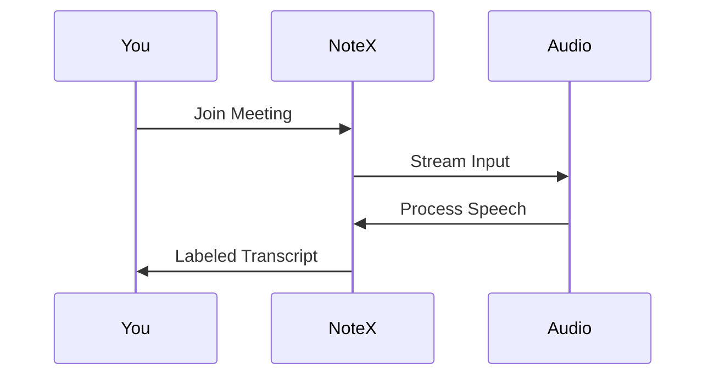

## Overview

NoteX empowers you to capture, analyze, and act on your meetings effortlessly. As an AI Meeting Assistant from Sotatek, it handles transcription, summarization, task extraction, and collaboration in one seamless platform. You focus on discussions while NoteX processes the details.

<Columns cols={2}>
  <Card title="Real-time Transcription" icon="mic" href="#transcription">
    Identify speakers and transcribe live with 99% accuracy.
  </Card>
  <Card title="AI Summaries" icon="sparkles" href="#summaries">
    Get instant highlights and key points from any meeting.
  </Card>
  <Card title="Action Items" icon="check-square" href="#actions">
    Extract tasks automatically and assign them to team members.
  </Card>
  <Card title="Searchable Archives" icon="search" href="#archives">
    Query past meetings and collaborate on shared notes.
  </Card>
</Columns>

## Real-time Meeting Transcription

NoteX transcribes meetings in real-time with speaker identification, supporting multiple languages. You join a call, and NoteX labels each speaker as "Speaker 1", "Alice", or by integrated calendar names.

<Callout kind="tip">
  Enable transcription before your meeting starts for the best accuracy.
</Callout>



### Integrate via API

Use the transcription endpoint to stream audio.

<CodeGroup tabs="JavaScript,Python">
  ```javascript
  const response = await fetch('https://api.example.com/v1/transcribe', {
    method: 'POST',
    headers: { 'Authorization': 'Bearer YOUR_API_KEY' },
    body: audioStream
  });
  const transcript = await response.json();
  ```
  ```python
  import requests
  response = requests.post(
      'https://api.example.com/v1/transcribe',
      headers={'Authorization': 'Bearer YOUR_API_KEY'},
      data=audio_stream
  )
  transcript = response.json()
  ```
</CodeGroup>

## AI-Powered Summaries and Highlights

After transcription, NoteX generates concise summaries, bullet-point highlights, and sentiment analysis. You receive them instantly via email or dashboard.

<Tabs>
  <Tab title="Dashboard View" icon="monitor">
    Access summaries in your NoteX dashboard at `https://dashboard.example.com/meetings`.
  </Tab>
  <Tab title="API Access" icon="code">
    Fetch summaries programmatically.

    <ParamField path="meetingId" param-type="string" required="true">
      Unique meeting identifier.
    </ParamField>

    ```javascript
    const summary = await fetch(`https://api.example.com/v1/summaries/${meetingId}`, {
      headers: { 'Authorization': 'Bearer YOUR_API_KEY' }
    }).then(res => res.json());
    ```
  </Tab>
</Tabs>

## Action Item Extraction

NoteX scans transcripts for tasks like "Follow up on Q3 budget" and extracts them as actionable items. You assign owners, set due dates, and integrate with tools like Slack or Jira.

<Steps>
  <Step title="Review Transcript" icon="search">
    Open your meeting in NoteX.
  </Step>
  <Step title="Extract Actions" icon="zap">
    Click "Generate Actions" – NoteX identifies 5+ items automatically.
  </Step>
  <Step title="Assign & Export" icon="users">
    Assign to teammates and export to your task manager.
  </Step>
</Steps>

<ResponseField name="actions" field-type="array">
  Array of detected tasks with assignee and due date.
</ResponseField>

## Searchable Archives and Collaboration

All meetings live in searchable archives. You query by keyword, speaker, or date, and share clips with your team for async collaboration.

<Expandable title="Advanced Search Filters" default-open="false">

Filter by:

| Filter     | Example Query          |
|------------|------------------------|
| Speaker    | from:alice budget     |
| Date Range | after:2024-01-01      |
| Keywords   | Q3 sales forecast     |

</Expandable>

<Callout kind="success">
  Archives retain 100% accuracy and support unlimited storage for teams.
</Callout>

These features make NoteX your ultimate meeting companion. Start with [quickstart](/quickstart) to set up your first transcription.